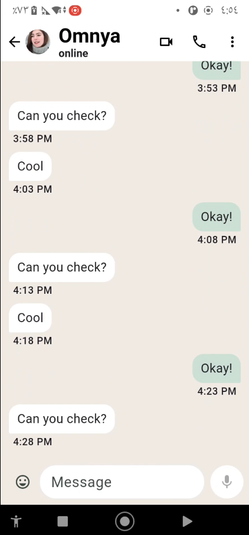

# Flutter WhatsApp Clone

A **Flutter chat application** inspired by WhatsApp.  
Supports messaging, chat bubbles, typing indicator, and responsive layouts for mobile and wide screens.

---

## Features

- **Chats Screen**
  - List of chats with avatars, last message, and unread count.
  - Hero animation when opening a chat.

- **Chat Screen**
  - Animated message bubbles with slide/fade effect.
  - Text composer with emoji, typing detection, and send button animation.
  - Messages spaced properly with horizontal margins for better UI.

- **Responsive Layout**
  - Supports narrow and wide screens with constrained width for better readability.

- **Mock Data**
  - Uses local mock data for chats and messages.

---

## Screenshots

| Chats Light | Chats Dark | Chat Light | Chat Dark |
|-------------|------------|------------|-----------|
|  |  |  |  |

| Stories Light | Stories Dark | Story Viewer |
|---------------|--------------|--------------|
|  |  |  |


---

## Getting Started

1. **Clone the repository**

```bash
git clone https://github.com/Omnyanasr/whatsapp-clone.git
cd whatsapp-clone
```

2. **Install dependencies**

```bash
flutter pub get
```

3. **Run the app**

```bash
flutter run
```

## Folder Structure

```bash
lib/
├─ data/  
│  └─  mock_data.dart        
├─ models/ 
│  ├─ chat_item_model.dart  
│  ├─ message_model.dart     
│  └─ story_model.dart
├─ theme/         
│  └─ app_theme.dart
├─ views/   
│  ├─ chats_screen.dart
│  ├─ chat_screen.dart
│  ├─ home_screen.dart
│  └─ stories_screen.dart
└─ main.dart
```
